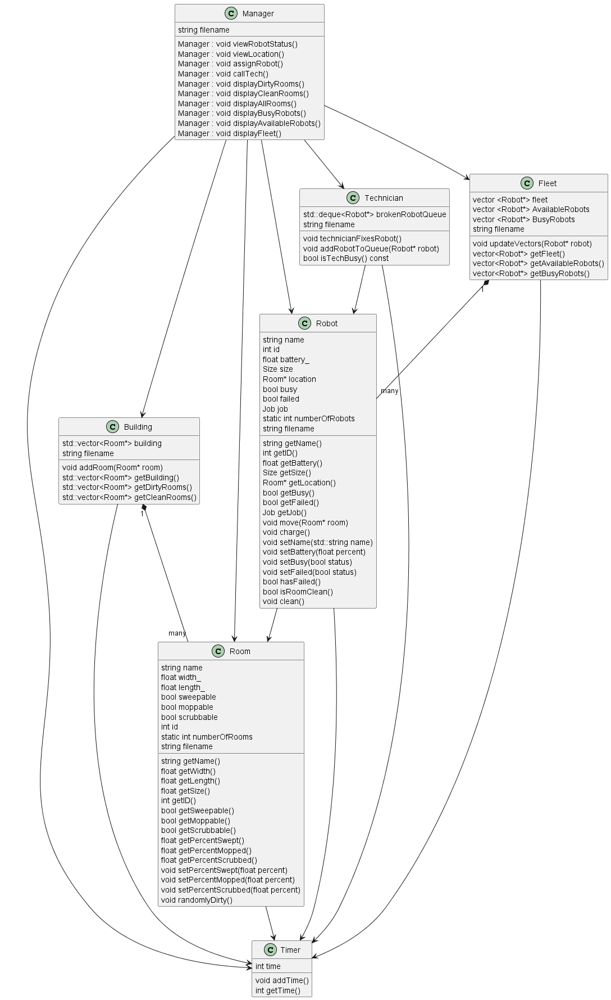

# Class Diagram

### Manager Class:
A class that represents the managers methods and objects. The manager is the user of the system or the manager of the building. The manager will be the one assignings robots to do jobs and will be able to view the status of all the robots. The manager class uses the Technician class, the Room class, and the Robot class.

### Robot Class:
A class that represents the methods related to a Robot and all its elements. The robot is responsible for cleaning the assigned rooms. A Robot is consisted of its name, size, battery level and location. We can use given functions to check the cleaning process of a room. With the functions we can move, charge, set the name, get the size and battery, check availability and failure and if a room is clean. The Robot class uses the Room class.

### Room Class:
A class that represents the members and methods of rooms.  A room has different attributes depending on how big it is, and how it should be cleaned (sweeped, mopped, or scrubbed).  The functions include us allow us to check how big the room is, as well as the ability to change how clean the room is, and a function that will randomly dirty the room.  The Room class is used by the Manager and Robot classes.

### Technician Class: 
A class that represnets the members and methods of a Technicien. A Technician needs a Robot to fix thus, depends on Robot class. A Technician can be busy fixing some robots. Hence, represented by methid isBusy() which contains a list of robots being fixed. A techinican class also has method isfixed() representing the status of fixing a robot - True or false for if a robot is fixed or not. Techician depends on Robot class.Manager class depends on Technician class.

### Fleet Class: 
A class representing a group of robots. A fleet class contains a list of robots called fleet, a list of robots which are availabe to work called AvailableRobots and a list of Robots that are busy working called BusyRobots. There is an aggragate relationship between Fleet Class and Robot Class. 

### Sweeper Class
Class that conatians the method Sweep() which orders the robot to sweep.There is an inheritance relationship between Sweeper and Robot classes where Robot is parent class. 

### Mopper Class
Class that conatians the method Mop() which orders the robot to mop. There is an inheritance relationship between Mopper and Robot classes where Robot is parent class. 

### Scrubber Class
Class that conatians the method Scrubb() which orders the robot to scrubb. There is an inheritance relationship between Scrubber and Robot classes where Robot is parent class.  

### Team Contributions: 
Jennie Campbell - We spoke about the entirty of the class diagram and the methods for each class as a group. I create the Manager class in the puml document and added all of its methods that were discussed. I also added any relationships Manager had with other classes.

Sofia Dimotsi - after going over our overall design and talking through each class during class I chose to implement the design for the Robot class. I added to the puml document the implementation of Robot class and the relationships between Robot class and the rest of the classes that we created as a team. I also exported the png file for the Class Diagram to make sure the diagrams are correctly described. 

Pierce Chancy - We talked through the entire diagram during our meetings.  I then updated our class diagram puml with the Room Class members and methods, as well as made some formatting more consistent.

Israa Draz - We talked about the entire diagram during our meetings.  I updated our  class diagram puml for the fleet, technician, sweep, scrubb, and mopper class members and methods and updated the documantaion for each. 