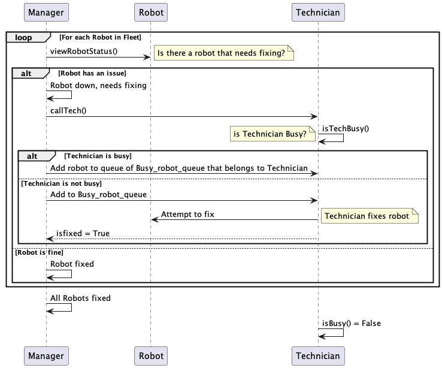
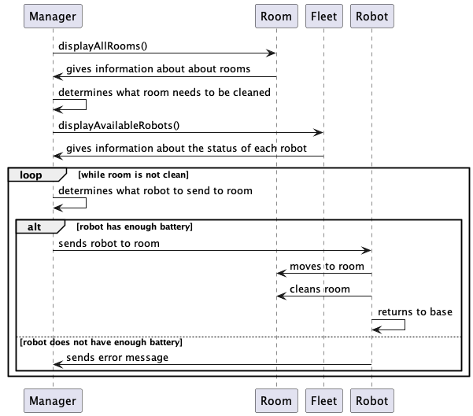
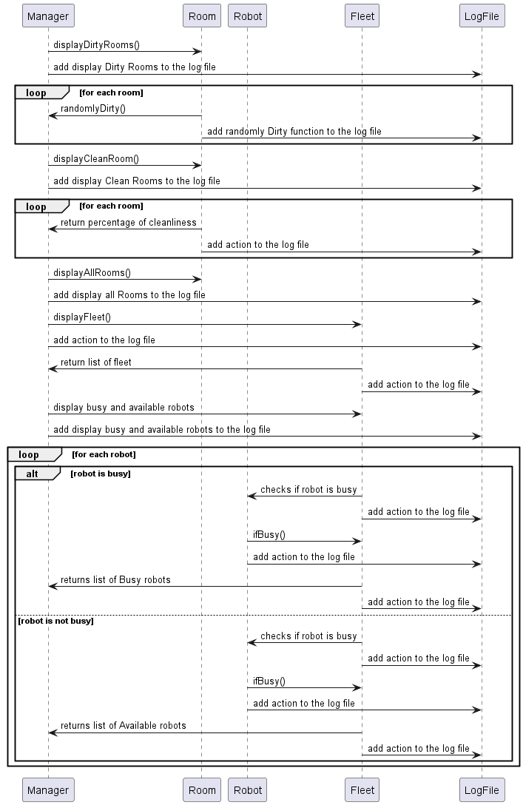

# Sequence Diagrams

### Sequence Diagram 1

This sequance diagram is based off the functionality of assigning a robot to technicien that fixes the robot. There are three main actors: Manager, Robot, and Technician. The Manager goes through a loop, where they check each Robot in the Fleet. For each Robot, the Manager checks its status - if robot need to be fixed or not - through viewRobotStatus(). If a Robot needs to be fixed is identified by Manager, Manager calls Technician using callTech().
 Technician checks if they're currently busy through method isTechBusy(). If the Technician is busy, Manager informs the Technician to add the robot that needs fixing Busy_robot_queue which is a queue of robots the need attention. Otherwise, if the Technician is not busy, Manager informs the Technician to add the robot to the Busy_robot_queue so that Technician can fix robot. After that, Technician fixes robot and then Technicien  notifies the Manager that the robot has been fixed by updating isfixed from false to true for the speific robot.
Finally, if Robot does not have any issue, Manager moves to another robot until finished. Simultaneously, our log file is being updated to include evry action (or error) right after it has occur.

### Sequence Diagram 2

This sequence diagram is based off the functionality of finding a room for a robot to clean and assigning it to that room. The participants are the Manager, Room, Fleet, and Robot. The manager requests to see all the rooms, which the Room then returns that information to them. The manager them determines which room needs to be cleaned. They then request the list of available robots and the fleet returns that list. The list contains information of the robots name, battery percentage, current status, type, etc. Then we have a loop of while the room is not clean, the manager determines which robot to send to the room. This is done by using an if statement determining if the robot has enough battery to clean. If it does, then the robot is assigned to the job by the manager and the robot cleans it and returns to base. If not, the robot sends an error message to the manager. The manager would then loop back up to determine a different robot to assign to the job. Simultaneously, our log file is being updated to include evry action (or error) right after it has occur.

### Sequence Diagram 3

This sequence diagram aims to illustrate the ability of the Manager to check in with the other participants (Room, Robot, Fleet). The Manager can ask to get a list of all the dirty and clean rooms. For each one of this commands respectively the cleanliness and dirtiness of every single room is being checked and appended on the final list. The Manager can also just ask for the list that contains all the rooms to be displayed. In addition there is some level of communication between the Manager and the Fleet. The Manager can ask to get the list of all the robots (in other words the fleet). The fleet can also be asked to differentiate between the busy and avaialable Robots by checking the value of the isBusy() function of a Robot. Again, each Robot regarding to the value of isBusy() is being added to the according list (available or busy). This sums up the relations depicted in this sequence diagram. Simultaneously, our log file is being updated to include evry action (or error) right after it has occur.

### Team Contributions

Sofia Dimotsi - We had our meeting and went over the way we should develop our sequence diagrams. I worked on the third one which describes the ways in which the Manager can call the display functions to check in with the other participants. I was responsible for updating all of the sequence diagrams to include the updates of the log file that occur after every action. I also updated my part of the documentation.

Israa Draz - We had our meeting and went over ways to create the sequance diagrams and splitting them to multiple sequance diagrams. I worked on the sequance diagram that handels the connections and functions between manager, robot and technician. I also updated my part of the documantaion.

Jennie Campbell - We discussed as a team how to develop our sequence diagrams and which ones we wanted to create. I worked with Pierce on the second sequence diagram. We also created the markdown file and made sure the previous ones were correct as well.

Pierce Chancy - We discussed how to develop our sequence diagrams as a team and chose which sequence diagrams to create.  Jennie and I worked together on sequence diagram 2, as well as making a markdown file for our sequence diagrams and ensuring that our documentation was up to date on the other parts of the project.
