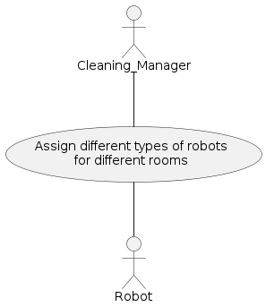
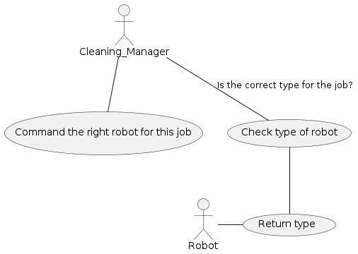
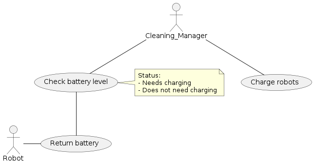
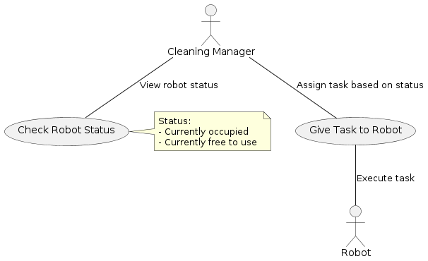
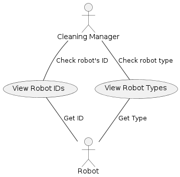
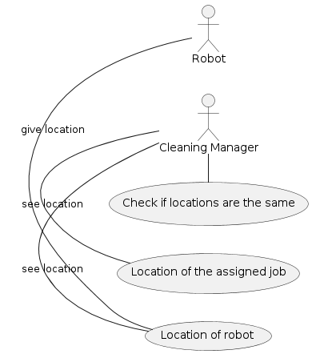
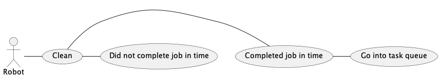
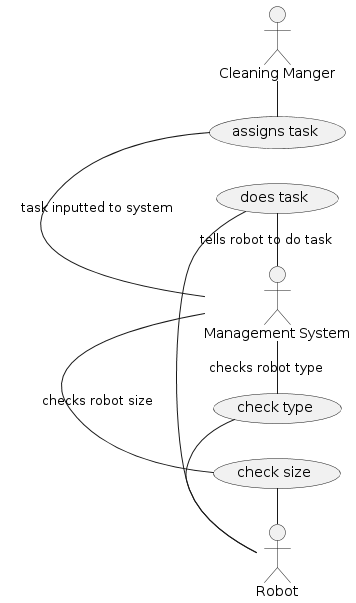
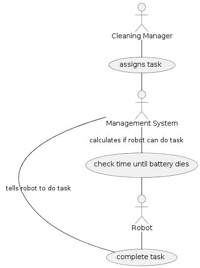

# USE CASES
### Use Case 1:

A use case diagram with the cleaning manager as an actor who wants to be able to have different types of robots so they can clean different rooms and surfaces.

### Use Case 2:

A use case diagram in which our actor, the cleaning manager, makes sure they're able to give a command to a specific type of robot which is right for the needed task.

### Use Case 3:

A use case diagram that describes a cleaning manager who wants to be able to check the battery level of robots so that they know which robots need to charge.

### Use Case 4:

A use case diagram that shows a cleaning manager who wants to be able to check what each robot's status is so that they can send them to do tasks accordingly.

### Use Case 5:

A use case diagram that shows a cleaning manager, who wants to be able to check if a robot has failed a task so that they can call someone to fix it and send a new robot to do the task instead.

### Use Case 6:

A use case diagram that shows a cleaning manager who wants to be able to see the IDs and types of robots so that they know what task each robot is doing.

### Use Case 7:

A use case diagram that shows how the cleaning manager can check the locations of the job and the robot to make sure they are the same.

### Use Case 8:

A use case diagram that shows what the robot will do if they do not complete their job in time.

### Use Case 9:

A use case diagram that shows how the robots recieves the room assignment for their job and the path they will take.

### Use Case 10:

A use case diagram that shows how the robot will first check if it is of the right size and right type to complete a task that is assigned before it tries to perform it.

### Use Case 11:

A use case diagram that shows how the robot will check if it has enough battery left to complete an assigned task before it tries to perform it.

### Team Contributions: 

Sofia Dimotsi - I asked for advice from my teammates on how the expected diagram of usecases 1, 2 and 3 should be and then proceed on creating the puml files for each usecase.

Israa Draz - I discussed the user stories with the group and proceed to the design of use case diagram for cases 4-6.

Jennie Campbell - I discussed the user stories and the designs with the group in our group chat and led the implementation and documentation of use case diagrams 7, 8, and 9.

Pierce Chancy - I discussed the user stories and the designs with the group in our group chat and led the implementation and documentation of use cases diagrams 10 and 11.  I also made gramattical and syntactical edits to the .puml and .md files, as well as led the update of .md files.
